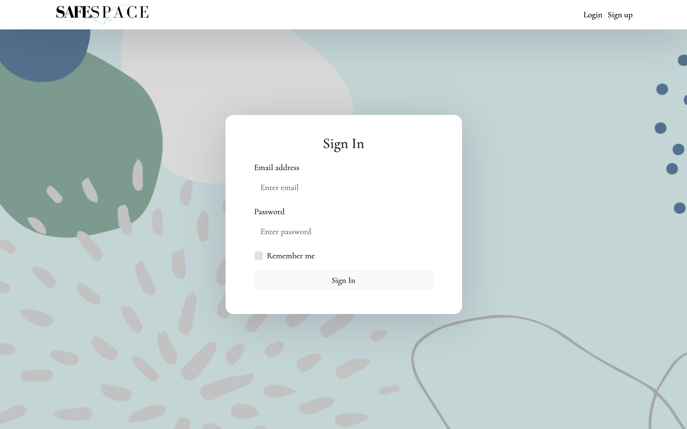
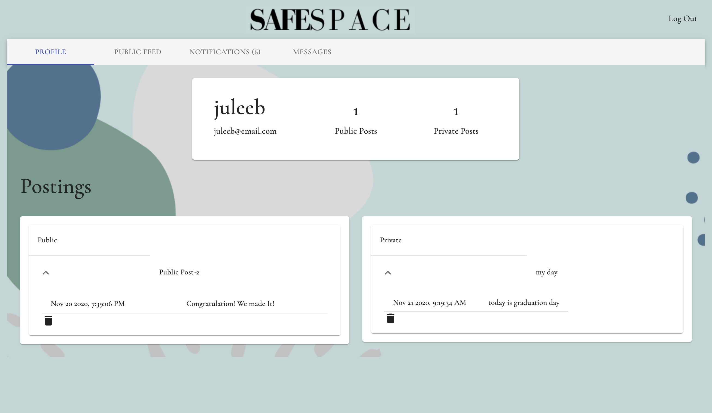

# safe space

### Team:
| Frontend:      | Backend:       |
| -------------- | -------------- |
| Aiya Siddig    | Cheyenne Hunt  |
| Julee Butler   | Conor Maguire |
| Jessica Feng   | Toogi          |

# Safe Space

Safe Space is an application for connecting individuals and creating community around by sharing thoughts to public or private during COVID-19 era to stay mentally healthy. 

## User Story

As a person with a lot on my mind, 

I want an app to share my thoughts or post them privately and anonymously, 

So that I can express myself and keep track of how I’m feeling.

## Table of Contents
  - [Installation](#installation)
  - [License](#license)

## Tools Used

* HTML
* CSS
* Javascript
* React
* Material-UI [https://material-ui.com/]
* Socket.io
* Express
* Node.js
* MongoDB
* Mongoose

## User Criteria

GIVEN The glass is desktop or mobile,

WHEN The user interacts with application,
THEN The pages are responsive,

GIVEN The user lands on the login page,

THEN User will be able to login or sign up to login to application.

WHEN The user login, 
THEN The home page will display the profile of the user and entry that user had posted (public and private).

WHEN User click public board,
THEN User will be able to see the entry that the other user has posted.

WHEN User click message,
THEN User will be able to search other users, send personal messages, and view a list of messages in the inbox.

WHEN User click alert,
THEN User will be able to view message alerts received from other users.

WHEN User click create note,
THEN User will be able to create new entry of note,
THEN User will be able to save public or private.

## Installation

1. Clone the repository.
2. npm install in the terminal to install all dependencies for application.
3. npm start to start the application locally.
4. The application should now be running on http://localhost:3000.

## Deployment (Heroku)

[https://safe-space-2020.herokuapp.com/]

## Git Repository (GitHub)

[https://github.com/Toogii2019/safe_space]

## License 

This project is licensed under MIT license. 